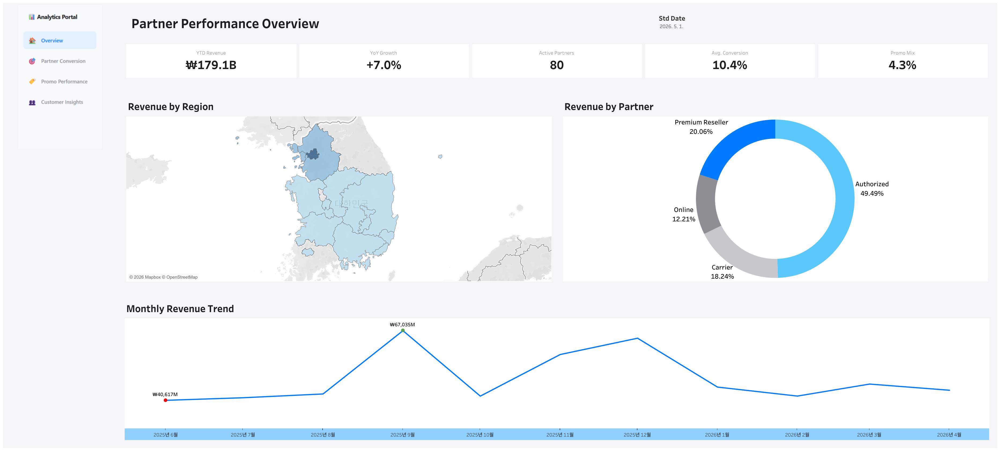
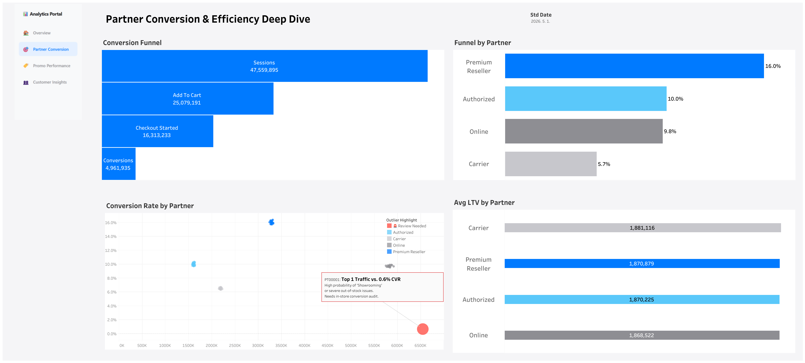
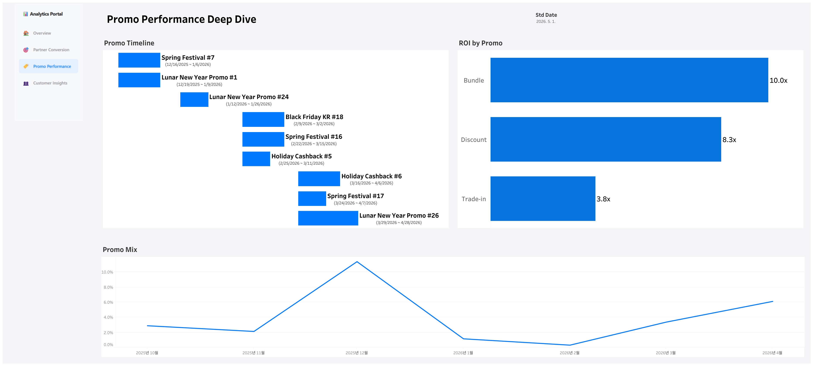
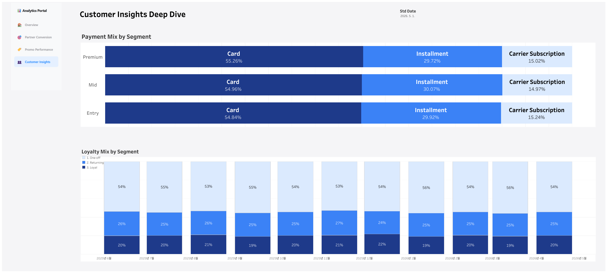

# Sales Analytics — Tableau Portfolio

> An end-to-end commercial analysis project that simulates the role of a **Data Analyst**. Built with Python, SQL, and Tableau, it analyzes the core responsibilities of the enterprise.


---

## 🎯 Project Overview

The portfolio reconstructs the analytics workflow of the sales organization with **4 interconnection dashboards** mapped directly to the key responsibilities of the data analyst job description:

| Dashboard | JD Responsibility | Key Question Answered |
|---|---|---|
| **1. Partner Performance Overview** | Executive Reporting & Analytics | How is performing YoY across regions and partner tiers? |
| **2. Conversion & Efficiency Deep Dive** | Partner Traffic & Conversion Analysis | Where are partners losing customers in the funnel? |
| **3. Promo Performance Deep Dive** | Offer & Promotion Tracking | Which promotions drive the highest ROI? |
| **4. Customer Insights Deep Dive** | CRM & Affordability Insights | How do payment preferences and loyalty differ by segment? |

---

## 🛠 Tech Stack

- **Python 3.10+** — Synthetic data generation (Faker, NumPy, Pandas)
- **CSV-based Data Model** — 7 normalized tables (3 dimensions + 4 facts)
- **Tableau Desktop 2024.1** — Relationship-based data modeling, LOD expressions, calculated fields

---

## 📊 Dashboard 1: Partner Performance Overview

**Audience**: Executives | **Refresh**: Daily | **Reference Date**: May 2026



### Key Insights
- **YTD Revenue ₩179.1B** with **+7.0% YoY growth**
- **80 active partners** across all 17 Korean regions
- **10.4% average conversion rate** (sessions → purchase)
- **4.3% promo-driven revenue share** indicates organic demand strength
- **Authorized** at 49.5% of total revenue, followed by Premium Reseller (20.1%)
- **Seoul and Gyeonggi** together account for the deepest blue intensity on the heatmap
- **September 2025 spike (₩67B)** corresponds to the new product launch season

### Components
- 5 KPI cards (YTD Revenue, YoY Growth, Active Partners, Avg. Conversion, Promo Mix)
- South Korea region heatmap
- Partner tier donut chart
- Monthly revenue trend with peak/trough callouts

---

## 📊 Dashboard 2: Partner Conversion & Efficiency Deep Dive

**Audience**: Sales Operations | **Focus**: Channel Optimization



### Key Insights
- **Funnel drop-off (Step Conversion)**: 47.5M sessions → 25.0M add-to-cart (52.7%) → 16.3M checkout (65.1%) → 4.96M purchases (30.4%)
- **Funnel drop-off (Overall Conversion)**: 47.5M sessions → 25.0M add-to-cart (52.7%) → 16.3M checkout (34.3%) → 4.96M purchases (10.4%)
- **Premium Reseller leads with 16.0%** overall conversion, **Carrier lags at 5.7%**
- Scatter plot reveals **conversion outliers** by partner tier — Premium Reseller cluster sits highest at 15-17%
- **Avg LTV by tier** shows surprisingly tight band (₩1.85M ~ ₩1.87M) — suggests opportunity to differentiate Premium customer experience further
- **Actionable Anomaly Detection**: Scatter plot isolates a critical outlier with **Top 1 traffic vs. 0.6% CVR**, alerting potential offline "Showrooming" effects or severe inventory bottlenecks.

### Components
- Funnel chart (4-stage)
- Funnel completion rate by partner tier
- Partner-level scatter plot (Sessions × Conversion Rate)
- Avg LTV ranked bar chart by tier

---

## 📊 Dashboard 3: Promo Performance Deep Dive

**Audience**: Marketing & Channel Managers | **Focus**: Campaign ROI



### Key Insights
- **Bundle promotions deliver the highest ROI at 10.0x**, far outperforming Discount (8.3x) and Trade-in (3.8x)
- Gantt timeline reveals **dense promo overlap during Lunar New Year and Spring Festival** windows
- Promo Mix trendline shows **revenue contribution peaked at 11% in late 2025**, then dropped to 0.3% before recovering — indicates a planned cooling period followed by spring re-launch

### Components
- Gantt chart of promotion campaigns
- ROI ranking by promotion type
- Promo-driven revenue mix trendline

---

## 📊 Dashboard 4: Customer Insights Deep Dive

**Audience**: CRM & Customer Experience Teams | **Focus**: Segment Behavior



### Key Insights
- **Payment mix is remarkably consistent across segments**: ~55% Card, ~30% Installment, ~15% Carrier Subscription — suggesting payment preference is driven more by product price point than customer tier
- **Loyalty distribution by month** shows steady ~54% one-off, ~25% returning, ~20% loyal customers — a healthy balance indicating both acquisition and retention are functioning
- One-off purchase share peaked at 56% in Jan 2026

### Components
- Payment Mix by Segment (100% stacked bars)
- Loyalty Mix by Segment over time (monthly stacked bars)

---

## 🗂 Data Model

```
                      ┌──────────────┐
                      │   dim_date   │
                      └──┬────────┬──┘
                         │        │
                  ┌──────┘        └──────┐
                  │                      │
            ┌─────▼──────┐        ┌──────▼───────┐
            │ fact_sales │        │ fact_traffic │
            │   (~500K)  │        │    (~58K)    │
            └─────┬──────┘        └──────┬───────┘
                  │                      │
                  ├────────┬─────────────┤
                  │        │             │
            ┌─────▼─────┐  │      ┌──────▼──────┐
            │dim_product│  │      │ dim_partner │
            │   (200)   │  │      │     (80)    │
            └───────────┘  │      └──────┬──────┘
                           │             │
                  ┌────────▼─────┐       │
                  │fact_promotion│       │
                  │     (36)     │       │
                  └──────────────┘       │
                                         │
                                  ┌──────▼──────┐
                                  │  fact_crm   │
                                  │   (100K)    │
                                  └─────────────┘
```

**Date range**: 2024-05-01 ~ 2026-04-30

---

## 📁 Repository Structure

```
Sales-Analytics-Portfolio/
├── README.md
├── generate_data.py                      # Python data generator
├── data/                                 # 7 CSV files (auto-generated)
├── tableau/
│   └── sales_analytics_dashboard.twbx    # Packaged Tableau workbook
└── screenshots/                          # Dashboard screenshots
    ├── 01_partner_overview.png
    ├── 02_conversion_funnel.png
    ├── 03_promo_performance.png
    └── 04_customer_insights.png
```

---

## 🎨 Design Principles

This portfolio adopts the following design philosophy:

- **Minimalism** — Removed gridlines, generous whitespace, single-purpose visuals
- **Hierarchy** — KPI cards at top, supporting visuals below
- **Color discipline** — #007AFF primary, gradient blues for sequential data, gray for context
- **Typography** — Tableau Semibold / Tableau Medium / Tableau Book

---

## 📌 Key Calculated Fields (Tableau)

```tableau
// Fiscal YTD Revenue
// Calculated assuming that the fiscal year begins on October 1st
SUM(
  IF YEAR(DATEADD('month', 3, [Sale Date])) = YEAR(DATEADD('month', 3, [Std Date]))
  AND [Sale Date] <= [Std Date] THEN [Net Revenue Krw] END
)

// YoY Growth
// [Fiscal PYTD Revenue] cumulative sales for the same period last year
( [Fiscal YTD Revenue] - [Fiscal PYTD Revenue] ) / [Fiscal PYTD Revenue]

// Fiscal YTD Conversions
SUM(
  IF YEAR(DATEADD('month', 3, [Traffic Date])) = YEAR(DATEADD('month', 3, [Std Date]))
    AND [Traffic Date] <= [Std Date] THEN [Conversions] END
)

// Promo Mix
SUM(
  IF NOT ISNULL([Promo Id]) 
    AND YEAR(DATEADD('month', 3, [Sale Date])) = YEAR(DATEADD('month', 3, [Std Date]))
    AND [Sale Date] <= [Std Date] THEN [Net Revenue Krw] END
)
/ [Fiscal YTD Revenue]

// Outlier Hight
IF SUM([Sessions]) > 5000000 AND [Avg. Conversion] < 0.02 THEN '🚨 Review Needed' 
ELSE ATTR([Partner Tier]) END
```

---

## 📬 Contact

**[Sunghoon Jun]** — Data Analyst
- 📧 trixar17@gmail.com
- 💼 [LinkedIn](https://www.linkedin.com/in/trixar17)
- 📊 [Tableau Public](https://public.tableau.com/app/profile/sunghoon.jun)
- 🧾 [Notion](https://intelligent-king-205.notion.site/Sales-Analytics-Portfolio-35ab35986d798002a854e2021019e93e)

---

## 📄 License

This project uses **synthetic data only**. Built for portfolio purposes.

